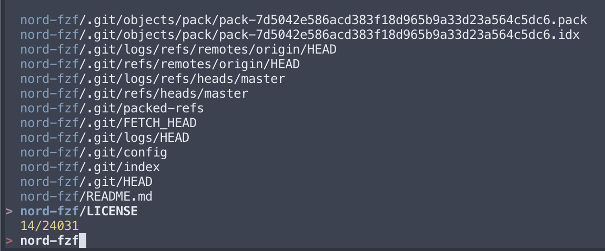

# nord-fzf

A [Nord colour palette](https://www.nordtheme.com/) for the [fzf](https://github.com/junegunn/fzf) command-line fuzzy finder tool.

Generated using: https://minsw.github.io/fzf-color-picker/



## Installation

Note: this works best when your terminal is also set to use a Nord colour palette. The palette I use with [Kitty](https://sw.kovidgoyal.net/kitty/) can found in my dotfiles [here](https://github.com/ianchesal/dotfiles/blob/main/kitty/nord.conf). My old iTerm2 settings are [here](https://github.com/ianchesal/dotfiles/blob/main/iterm/Nord.itermcolors).

Add the following your .(zsh|bash)rc configuration to set the colours used by fzf.

```
export FZF_DEFAULT_OPTS=$FZF_DEFAULT_OPTS'
    --color=fg:#e5e9f0,bg:#3b4252,hl:#81a1c1
    --color=fg+:#e5e9f0,bg+:#3b4252,hl+:#81a1c1
    --color=info:#eacb8a,prompt:#bf6069,pointer:#b48dac
    --color=marker:#a3be8b,spinner:#b48dac,header:#a3be8b'
```
